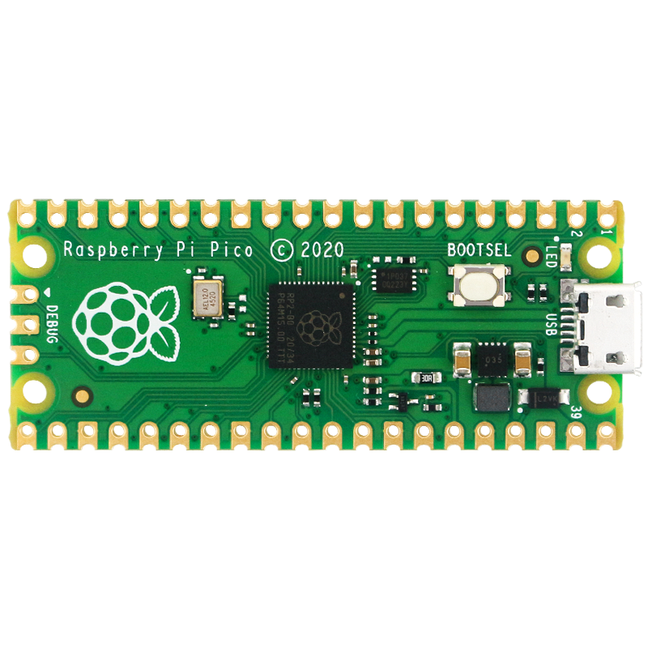
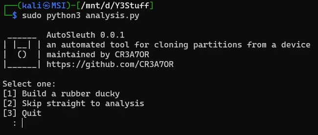

<div align="center">
  <h1> │ AutoSleuth │ </h1>
</div>

My Bachelor level project which is split into two main individual yet cooperative parts. The project itself is a hardware based solution paired with a command line interface that relies on a rubber ducky device armed with a payload that is capable of extracting a disk image across Windows and Linux devices when plugged in. This is then distributed over a network to a receiving server and analysis of the disk image once extraction is complete can occur. The goal is for the process to be simple and streamlined once setup. *(The project is not perfect and mostly stands as a proof of concept within the proposal of automation for digital forensics)*
| Linux  | Windows |
|--------|---------|
|  |  |


### »│ Technical Breakdown
#### │ Part 1:
> - Using a `Rubber Ducky Device`, with the payload written in `Ducky Script` that aims to make a complete and correct copy of a device's internal storage media without state change by relying on built in command line utilities of the device with additional executables such as `ftkimager` for Windows that are statically built. 
> - The raw data is then sent over HTTPS using a `Rust` executable which reads 1MB chunks from stdin and forms POST requests tracking the offset sent as string query
> - Listening server where a `PHP` receiver saves the received content to a image file named in the format `partition_label-ID-MM-YYYY.img` tracking the offset string query

#### │ Part 2: 
> - Automated analysis of the retrieved disk image using a `Python` script which listens in on the directory of the images and once discovered proceeds to perform analysis by using `SleuthKit` tools on the image files. 
> - Outputs are then stored into a .txt file which can be reviewed after completion. 

```diff
- THOUGH THESE PARTS ARE COOPERATIVE EACH ELEMENT IS FULLY FUNCTIONAL INDEPENDENTLY OF EACH OTHER ALONG FOR EASY MODIFICATION -
```

## »│ Setup 

### » Hardware: 
**1.** Device that is capable of emulating a Keyboard on operating systems with storage for a payload. For this project a Pico Pi was used to achieve this though any device such as a [Hak5 rubber ducky](https://shop.hak5.org/products/usb-rubber-ducky-deluxe) could be used.


Tutorial for setting up a Pico Pi into a rubber ducky can be found below:

[Pico Pi Rubber Ducky Setup](https://github.com/dbisu/pico-ducky)
*(analysis.py completes steps 6-7 so only prerequisite of step 5 is required in the tutorial)*

**2.** *(required for Pico Pi)* A USB that is able to store the required Rust executables and ftkimager files as the Pico Pi does not contain enough internal storage for these 

### » Software: 
```
For successful operation the following files/folder are required:
- Builder
- analysis.py
- commands.txt
- offset.txt
- receiverv2.php
```

Run `analysis.py` and select one of the two options
1. Option **1** will walk you through a series of questions to setup the two devices for deployment
2. Option **2** allows you to skip straight to the listening step for any image files to be analysed



## »│ Operartion

» Plug the Pico Pi & USB into the target machine \
⋅⋅⋅│ Ducky Code has been tested on Windows / Ubuntu / Debian \
» Maintain `analysis.py` running on the server \
⋅⋅⋅│ Once received the script will begin a subprocess on a new thread for analysis \
» Make sure that the `receiverv2.php` is visible on a public server \
» `commands.txt` is a template file for automation of any additional commands to be ran and have their output stored

Can watch the use for both Linux and Windows operating systems [here](https://youtu.be/3uT5HS6frBo)

<div align="center">
--- [ 𝗖𝗥𝟯𝗔𝗧𝟬𝗥 ] // Designed By --- 
</div>
